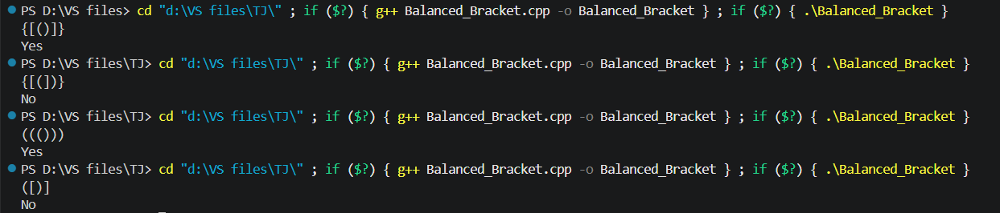
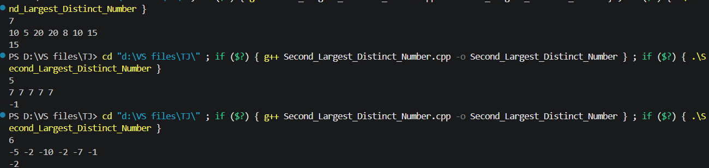

# TJ-TASKS: DSA Submission

Hi everyone! I am **Kushagra**, a second-year B.Tech student. This repository contains my solutions and reflections for the **TechnoJam DSA Tasks (Easy)**.

---

## Task: Balanced_Brackets

### 1. Initial Thought Process & Challenges
My first intuition was to store the brackets in a `std::vector` and inspect elements from both ends using two symmetric indices:
* Iterating `i` from `0` to `n - 1`
* Comparing `arr[i]` with its counterpart `arr[n - i - 1]`

#### Challenges Encountered:
- **Character Mismatch:** A direct equality check (`arr[i] == arr[n - i - 1]`) fails because matching brackets are distinct characters (e.g., `{` does not equal `}`).
- **Pattern Limitations:** Symmetric indexing only handles mirrored strings like `"{[()]}"` and breaks down on consecutive valid pairs such as `"()[]{}"` or nested sequences like `"()()"`.
- **Data Structure Requirement:** The problem guidelines suggested using a **Stack**. Since I was not yet familiar with Stacks, I looked for an alternative approach using data structures I knew well.

---

### 2. My Approach & Implementation
I implemented an approach utilizing `std::unordered_map` to map each opening bracket directly to its corresponding closing counterpart:

* Defined matching pairs: `'{' -> '}'`, `'(' -> ')'`, `'[' -> ']'`.
* Processed the brackets using conditional checks and an active flag to track whether each encountered bracket met the valid conditions.
* Updated validation status iteratively across the input traversal.

#### Complexity:
- **Time Complexity:** $\mathcal{O}(n)$ — Single pass traversal of the sequence.
- **Space Complexity:** $\mathcal{O}(1)$ auxiliary space for the bracket mapping.

---

### 3. Execution & Output

---
### 4. Issues
- While this program can solve most of the test cases, it fails to pass test cases like:- (){}[]. 
- Moving forward, I plan to learn stack in order to complete all the test cases.

## Task: Second Largest Distinct Element

### 1. Initial Thought Process & Challenges
My first approach was to sort the array and select the second-to-last element (`arr[n-2]`). However, this approach presented two critical flaws:
- **Time Complexity:** Sorting requires $\mathcal{O}(n \log n)$, whereas an optimal array traversal can run in linear time $\mathcal{O}(n)$.
- **Duplicate Values:** If the array contains duplicate largest values (e.g., `[10, 10, 8]`), `arr[n-2]` would evaluate to `10`, failing the requirement to identify the *distinct* second largest value (`8`).

---

### 2. Refining the Approach
To achieve an optimal single-pass $\mathcal{O}(n)$ time complexity, I transitioned to a two-variable tracking strategy:

1. **Handling Negative Inputs (`INT_MIN`):** Initializing tracking variables to `0` breaks whenever the array contains negative numbers (e.g., `[-5, -2, -8]`). To make the comparison work for any integer value, I used `INT_MIN` as the base value for second largest (`s`).
2. **First Condition (New Global Maximum):** If the current element `x > l`, the old largest element drops to become the new second largest (`s = l`), and `l` is updated to `x`.
3. **Second Condition (Between First & Second):** If `x < l` and `x > s`, the current element is strictly smaller than the largest but larger than the current second-largest. In this case, only `s` updates (`s = x`).
4. **Duplicate Exclusion:** Elements equal to `l` or `s` are implicitly skipped by using strict inequalities (`>`), preventing duplicate values from occupying both variables.
5. **Distinct Element Validation:** After a complete traversal, if `s` remains equal to `INT_MIN`, it implies no distinct second-largest element exists (e.g., all elements are identical, or the array has fewer than 2 distinct elements).

---

### 3. Complexity
- **Time Complexity:** $\mathcal{O}(n)$ — Single linear pass through the array.
- **Space Complexity:** $\mathcal{O}(1)$ — Constant auxiliary space using only two scalar variables.

---

### 4. Output
